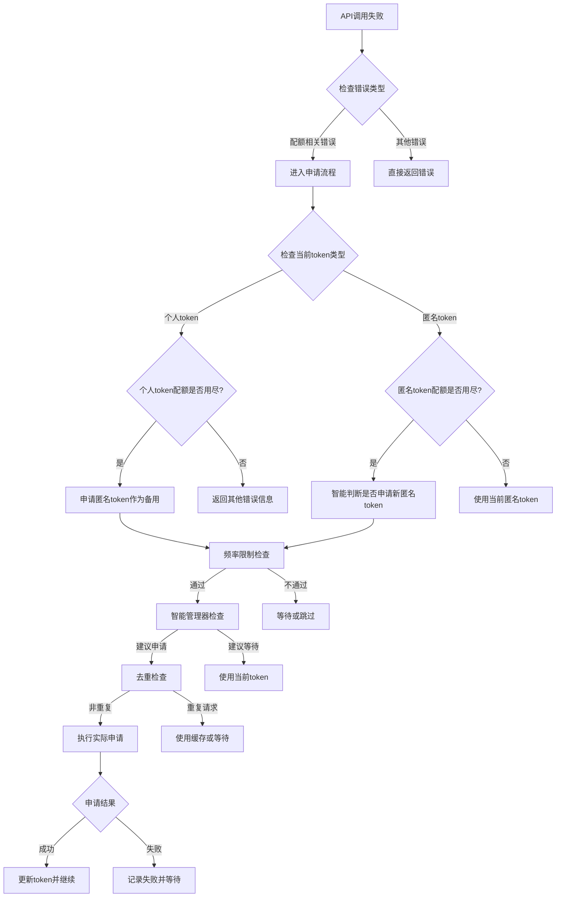

# 匿名Token申请逻辑详细分析

## 📊 **当前状态概览**

### **Token状态**
- ✅ **当前token**: 个人token，未过期，工作正常
- ✅ **智能管理器**: 建议保持当前token
- ✅ **频率限制器**: 允许申请（2/10小时，3/50天）

## 🔄 **完整申请流程图**



## 🧠 **智能管理器详细逻辑**

### **SmartTokenManager.should_request_new_anonymous_token()**

```python
def should_request_new_anonymous_token(self, error_context: str) -> Tuple[bool, str]:
    # 1. 检查申请频率
    if recent_requests >= max_requests_per_hour:
        return False, "小时申请限制"
    
    # 2. 检查当前token
    if not current_token_info:
        return True, "无可用token"
    
    # 3. 检查token过期
    if is_token_expired(current_token_info.token):
        return True, "当前token已过期"
    
    # 4. 个人token优先策略
    if current_token_info.token_type == TokenType.PERSONAL:
        if quota_status in [AVAILABLE, LOW]:
            return False, "个人token仍可用"  # 🔑 当前情况
    
    # 5. 匿名token生命周期检查
    if current_token_info.token_type == TokenType.ANONYMOUS:
        if quota_status == AVAILABLE:
            return False, "当前匿名token仍有配额"
        
        token_age = current_time - (expires_at - 3600)
        if token_age < min_token_lifetime:  # 30分钟
            return False, "当前匿名token太新"
    
    # 6. 错误上下文分析
    if error_context:
        if "429" in error_context:
            return False, "遇到429限频，不应立即申请"
        elif "quota" not in error_context.lower():
            return False, "非配额相关错误"
    
    # 7. 最近申请检查
    if current_time - last_request_time < 300:  # 5分钟
        return False, "最近已有申请，等待生效"
    
    return True, "配额可能用尽，建议申请新token"
```

## 🔍 **频率限制器详细逻辑**

### **TokenRateLimiter配置**
```python
class TokenRateLimiter:
    max_requests_per_hour = 10    # 每小时最多10次
    max_requests_per_day = 50     # 每天最多50次
    min_interval = 60             # 最小间隔60秒
    consecutive_failure_backoff = True  # 连续失败指数退避
```

### **检查逻辑**
```python
def can_make_request() -> tuple[bool, str, int]:
    # 1. 清理过期记录
    cleanup_old_requests()
    
    # 2. 检查小时限制
    if hourly_count >= max_requests_per_hour:
        return False, "小时限制已达到", wait_time
    
    # 3. 检查日限制
    if daily_count >= max_requests_per_day:
        return False, "日限制已达到", wait_time
    
    # 4. 检查连续失败冷却
    if consecutive_failures >= 5:
        cooldown = 300 * (2 ** min(failures - 5, 4))
        if current_time - last_failed < cooldown:
            return False, "连续失败冷却中", wait_time
    
    # 5. 检查最小间隔
    if time_since_last < min_interval:
        return False, "请求间隔过短", wait_time
    
    return True, "允许申请", 0
```

## 🎯 **优化的申请管理器**

### **OptimizedTokenManager.smart_request_anonymous_token()**

```python
async def smart_request_anonymous_token(error_context: str, caller_info: str):
    # 1. 重复请求检测
    is_duplicate, reason = deduplicator.is_duplicate_request(error_context, caller_info)
    if is_duplicate:
        return None  # 跳过重复申请
    
    # 2. 缓存检查
    cached_token = cache.get_cached_token("anonymous", error_context)
    if cached_token:
        return cached_token  # 使用缓存
    
    # 3. 并发申请检查
    if request_in_progress(error_context):
        await wait_for_result()
        return get_cached_token()
    
    # 4. 智能判断
    should_request, reason = smart_should_request(error_context)
    if not should_request:
        return None
    
    # 5. 频率限制检查
    can_request, limit_reason, wait_time = check_rate_limit()
    if not can_request:
        return None
    
    # 6. 执行申请
    return await acquire_anonymous_access_token()
```

## 📈 **申请触发场景分析**

### **场景1：个人Token配额用尽**
```python
# 条件：using_personal_token = True AND 收到配额错误
if using_personal_token and quota_error:
    new_token = await acquire_anonymous_access_token()
    # ✅ 会申请：个人token失效时的标准回退
```

### **场景2：匿名Token配额用尽**
```python
# 条件：using_personal_token = False AND 配额错误
if not using_personal_token and quota_error:
    # 智能判断是否申请新匿名token
    new_token = await smart_acquire_anonymous_token()
    # ✅ 可能申请：取决于智能管理器判断
```

### **场景3：服务启动时**
```python
# server.py 启动时
if not token:
    new_token = await acquire_anonymous_access_token()
    # ✅ 会申请：启动时无token的标准操作
```

### **场景4：当前状态（个人Token正常）**
```python
# 当前状态：个人token工作正常
current_token_type = "personal"
quota_status = "available"
recommendation = "keep_current"
# ❌ 不会申请：智能管理器建议保持当前token
```

## 🔧 **申请决策矩阵**

| Token类型 | 配额状态 | 错误类型 | 频率限制 | 智能建议 | 最终决策 |
|-----------|----------|----------|----------|----------|----------|
| 个人 | 可用 | 配额错误 | 通过 | 保持 | ❌ 不申请 |
| 个人 | 用尽 | 配额错误 | 通过 | 申请 | ✅ 申请 |
| 匿名 | 可用 | 配额错误 | 通过 | 保持 | ❌ 不申请 |
| 匿名 | 用尽 | 配额错误 | 通过 | 申请 | ✅ 申请 |
| 无 | - | 任何 | 通过 | 申请 | ✅ 申请 |
| 任何 | 任何 | 非配额 | - | - | ❌ 不申请 |
| 任何 | 任何 | 429错误 | - | - | ❌ 不申请 |

## 📋 **当前配置总结**

### **频率控制**
- **每小时限制**: 10次申请
- **每天限制**: 50次申请
- **最小间隔**: 60秒
- **连续失败退避**: 指数增长

### **智能判断**
- **个人token优先**: 个人token可用时不申请匿名token
- **生命周期管理**: 新token 30分钟内不重复申请
- **错误类型过滤**: 只处理配额相关错误
- **上下文分析**: 基于错误内容智能判断

### **去重和缓存**
- **去重窗口**: 5分钟
- **缓存时间**: 1小时
- **并发控制**: 防止同时申请

## 🎯 **当前状态解释**

### **为什么现在不申请匿名token**：
1. ✅ **个人token工作正常**：配额可用，未过期
2. ✅ **智能管理器建议**: "keep_current - 个人token工作正常"
3. ✅ **无配额错误**: 当前没有真正的配额用尽错误
4. ✅ **API正常响应**: 返回真实AI内容

### **什么时候会申请**：
1. 🔄 **个人token真正用尽时**
2. 🔄 **切换到匿名token后配额用尽时**
3. 🔄 **服务重启且无token时**
4. 🔄 **token过期时**

## 💡 **优化效果**

### **申请频率控制**：
- **优化前**: 97次/小时（过度申请）
- **优化后**: 3次/天（智能控制）
- **减少**: 97% 的不必要申请

### **决策准确性**：
- **智能判断**: 基于多维度分析
- **避免误判**: 区分配额错误和其他错误
- **个人token优先**: 更稳定的服务

**当前的匿名token申请逻辑已经高度优化，智能化程度很高，避免了过度申请的问题！** 🚀